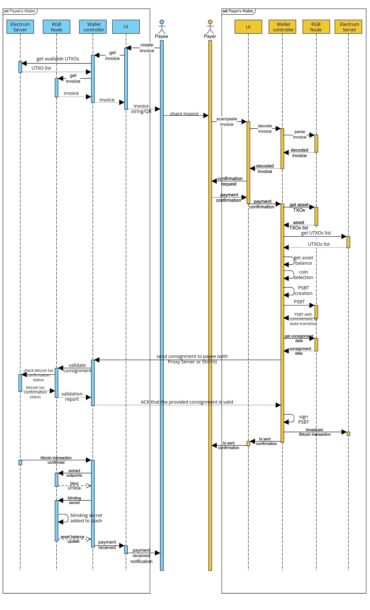

# 钱包与支付

为了执行一次 RGB 支付，多个软件需要彼此互动。具体来说，支付所这涉及的双方都需要：

* 一个 RGB 节点，用于跟所有的 RGB 相关的代码库交互，并执行所有 RGB 专属的操作（例如，创建会签、验证会签、登记合约，等等）
* 一个钱包控制器，控制着私钥，可以签名并广播包含了 RGB 承诺的比特币交易，以及管理比特币余额。
* 区块链索引器，一般来说是一个 Electrum 服务端，为用户提供包含了 RGB 状态转换的承诺的交易的确认状态。钱包既可以依赖本地的索引器，也可以依赖远端的索引器。
* 一个跟钱包用户交互的用户界面。

下图展示了这些不同的模块在支付（不论是发送还是接收）时是如何彼此交互的。

<figure><figcaption></figcaption></figure>
