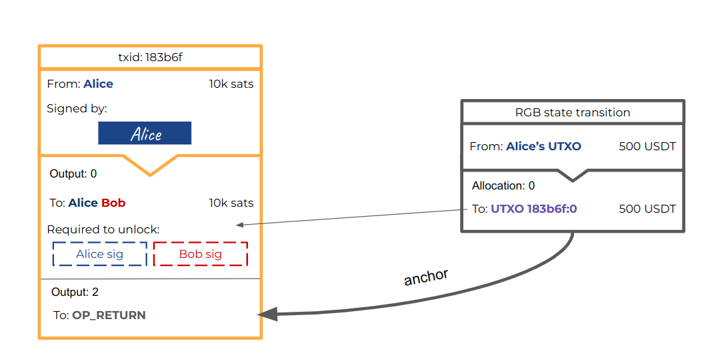
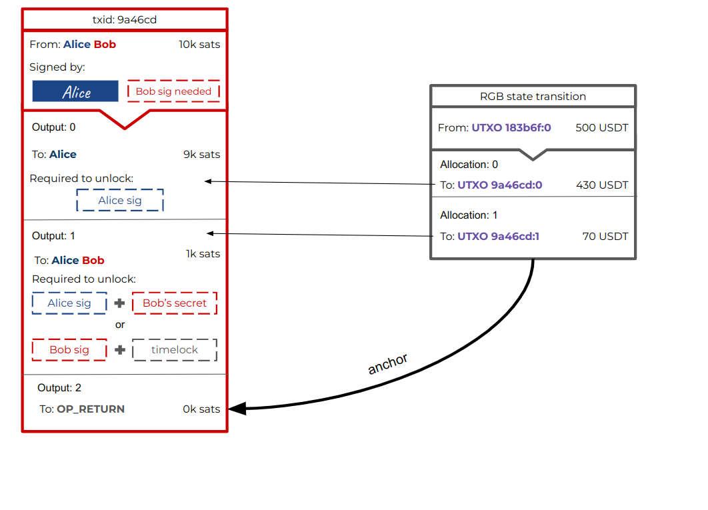
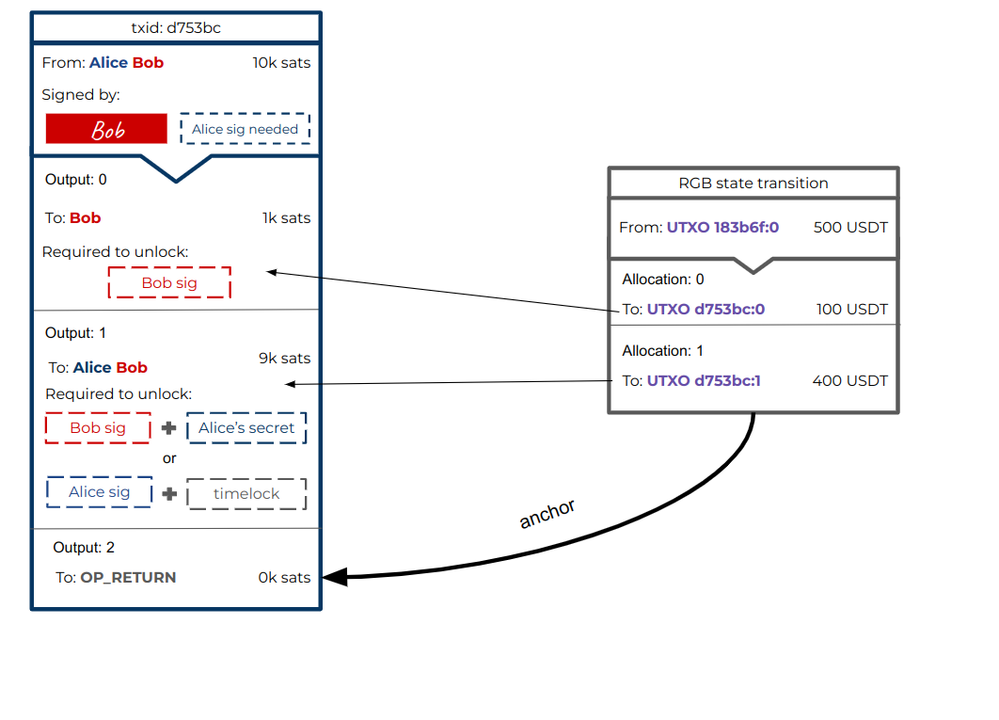
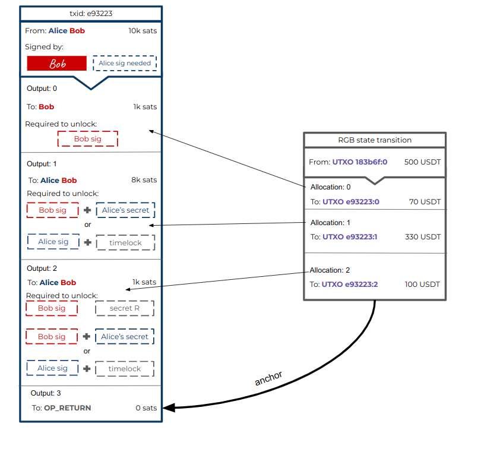

# 闪电网络兼容性

当一次状态转换被承诺到一笔比特币交易中时，这样的交易并不需要立即在区块链上结算，因为它可以成为一条闪电网络支付通道的一部分，然后从中获得安全性。如此一来，每次这条闪电通道更新的时候，就可以有一笔新的 RGB 转账被承诺到新的一笔通道更新交易中，并作废旧的一笔转账。因此，使用闪电通道来移动 RGB 资产、像常规的闪电支付那样跨通道路由 RGB 支付，都是有可能的。

RGB 闪电通道成立的第一步是一笔注资交易。注资操作由两部分组成：（1）比特币注资交易，以创建多签名输出；（2）RGB 资产注入操作，将资产发送到这个多签名 UTXO 中。需要比特币资金，是为了创建通道 UTXO，让 RGB 资产可以放入；但是，注入的比特币并不需要是大额资金，只要足以让闪电承诺交易的每一个输出不至于变成粉尘输出（面额过小因此无法单独使用的输出 —— 译者注）即可。

<figure><figcaption>
在这个案例中，Alice 跟 Bob 开启了一条通道，注入了 10000 聪和 5000 USDT。这里，RGB 承诺被添加到了一个专门的 OP_RETURN 输出中，但也可以使用 Taproot 输出；这两种承诺方案 RGB 都支持。
</figcaption></figure>

准备好注资交易之后，双方不必急着签名和广播，先准备好让双方都可以随时单方面关闭通道的承诺交易。这里的承诺交易的结构跟普通的闪电通道几乎是一样的，唯一的区别在于添加了一个额外的输出，以包含指向 RGB 状态转换的 RGB 锚点；在我们这个案例中使用 OP\_RETURN 承诺方案，但在 Taproot 支付通道可用之后，也可以使用 Taproot 承诺方案。

这里的 RGB 状态转换，将从这个多签名输出中移出资产，转入被闪电承诺交易创建的输出中。这样一来，RGB 状态转换就从闪电承诺交易中直接继承了所有的安全特性，可以处理单边关闭通道的情形。这意味着，如果 Bob 广播了一个旧状态，Alice 将可以使用 Bob 的秘密值来花费他的输出；而在花费这个输出时，她不仅可以将所有的聪都转移到一种完全由她控制的地址中，还可以将其中的 RGB 资产转移到自己的 UTXO 中。如此一来，对尝试使用旧状态来欺诈对手的经济惩罚，将不仅来自于通道中的比特币（可能数量并不大），还来自于通道中锁定的所有 RGB 资产。

另一方面，如果被 Bob 广播的承诺交易就是通道的最新状态，Alice 也无法发送惩罚交易，而 Bob 将能在时间锁过期后取出其中的聪和 RGB 资产。

<figure><figcaption>
由 Alice 签名的承诺交易，可以被 Bob 广播，带有相关的 RGB 状态转换。
</figcaption></figure>

<figure><figcaption>
由 Bob 签名的承诺交易，可以被 Alice 广播，带有相关的 RGB 状态转换。
</figcaption></figure>

如我们在这个案例中看到的，其中的 RGB 状态转换，将资产移动到由闪电承诺交易创建的、对应于双方的输出中；这意味着，在由 Bob 控制的承诺交易（上图中红色边框的那一笔）中，第一份 RGB 资产是可以由 Alice 直接花费的；而第二份既可以由 Bob 在时间锁过期后花费，也可以由 Alice 使用 Bob 的秘密值来花费。

### 更新通道

当双方之间发生支付、通道的状态需要更新时，他们俩就创建一对新的承诺交易。新的承诺交易中的输出的比特币数额是不想管的，可能跟上一个状态保持不变，也可以改变（取决于实现），因为它们的功能是创建新的 UTXO，而不是移动以比特币表示的经济价值。不过，OP\_RETURN 输出（未来的 Taproot 输出）需要改变，因为它必须包含一个新的 RGB 锚点，指向一次新的 RGB 状态转换；它将更新资产的数额，以反映支付发生后双方的新余额（因此跟上一个 RGB 锚点不同）。在下面这个例子中，Alice 给 Bob 发送了 300 USDT，让余额状态变成了 Alice 拥有 400 USDT、Bob 拥有 100 USDT。

<figure><figcaption></figcaption></figure>

<figure><figcaption></figcaption></figure>

注意，在 RGB 状态转换中，虽然分配资产的 UTXO 端点随着闪电承诺交易更新而改变，但 RGB 的输入一直是最初那个注资操作所形成的多签名输出；通道关闭之后，资产才会在链上完成分配。

### 加入 HTLC

以上，我们只是了解了仅涉及两方的简化版支付通道，但因为在现实中，闪电网络也被设计成可以向更多参与者路由支付，所有的支付实际上都使用 HTLC 输出。在 RGB 通道中，它的工作方式也完全一样，对于流经通道的每一笔支付，都在闪电承诺交易中添加一个专门的 HTLC 输出。这个 HTLC 输出需要拥有高于粉尘输出门槛的面额，但依然不必是大额。加上新的 HTLC 输出，RGB 状态转换需要加入一个新的分配，将支付相关的资产数额发送到新的 HTLC 输出中。无论谁能花费这个 HTLC 输出，也不论是知晓了秘密值还是等到时间锁过期，只要能花费它，也就能同时转移输出中的聪以及附着于其上的资产。

<figure><figcaption></figcaption></figure>

上面的例子仅包含了一个 HTLC 输出，但实际上可以为待完成的路由支付添加更多 HTCL，每一个新的 HTLC 输出，都在 RGB 状态转换中拥有对应的一份 RGB 资产。
